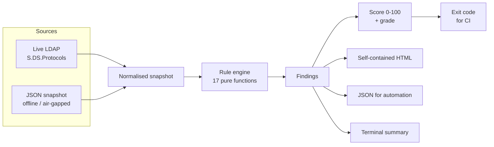

# ADRot

**Find the rot in your Active Directory. One script, no install, read-only.**

[](https://github.com/mistermobilka-spec/adrot/actions/workflows/ci.yml)
[](LICENSE)
[](https://github.com/PowerShell/PowerShell)
[](#why-no-rsat)

ADRot scans Active Directory for the security rot that accumulates in every domain —
unconstrained delegation, Kerberoastable service accounts, `PASSWD_NOTREQD`,
never-expiring passwords, admin-group sprawl, a `krbtgt` password nobody has rotated
since 2019 — and gives you a 0–100 score with prioritised, actually-remediable findings.

It **never writes to the directory**. Every LDAP operation is a search. There is no code
path in ADRot that issues an add, modify or delete.

---

## The problem

Every domain rots. Nobody notices, because the rot is invisible from the ADUC console:
a checkbox set in 2014 for a printer that no longer exists, a service account somebody
gave an SPN and a twelve-character password, forty people in Domain Admins because
removing anyone felt risky.

The tool everyone reaches for is [PingCastle](https://github.com/netwrix/pingcastle) —
excellent, and now Netwrix-owned. It is a .NET binary under the Non-Profit OSL, its
scheduling, multi-domain and trending features sit behind paid tiers, and **auditing
someone else's organisation requires a commercial licence** — which is a standing tax on
every MSP and consultant.

ADRot is MIT, pure PowerShell, and does one thing: tells you what's rotten, why it
matters, and how to fix it.

## What it looks like

```console
$ Invoke-ADRotScan

  ADRot — Active Directory hygiene report
  rot.example.com  ·  captured 2026-07-01T00:00:00Z

  Score   0/100  grade F
  17 findings — 2 critical, 7 high, 7 medium, 1 low
  Scanned 10 users, 4 computers, 2 groups against 17 rules

  ────────────────────────────────────────────────────────────────────────────

   CRITICAL  AD-001  Accounts store passwords with reversible encryption
           1 affected
             · legacy.radius — Reversible encryption enabled

   CRITICAL  AD-012  Unconstrained Kerberos delegation is enabled
           1 affected
             · PRINT01$ — TRUSTED_FOR_DELEGATION set (unconstrained)

   HIGH      AD-004  User accounts carry a servicePrincipalName (Kerberoastable)
           1 affected
             · svc-sql — SPN: MSSQLSvc/sql01.rot.example.com:1433

   HIGH      AD-009  Tier-0 administrative groups are oversized
           1 affected
             · Domain Admins — 6 members (threshold 5)

   HIGH      AD-015  The krbtgt password has not been rotated recently
           1 affected
             · krbtgt — Password set 900 days ago (threshold 180)

   MEDIUM    AD-016  Any authenticated user can join computers to the domain
           1 affected
             · ms-DS-MachineAccountQuota — Set to 10; every authenticated user
               may create that many computer accounts

  ────────────────────────────────────────────────────────────────────────────
  Run with -HtmlPath to produce the full report with remediation guidance.
```

`-HtmlPath` produces a self-contained HTML report — one file, no CDN, no webfont, no
remote anything — with the rationale, remediation steps and every affected object.
See it for yourself against the bundled fixture:

```powershell
Invoke-ADRotScan -SnapshotPath ./tests/fixtures/dirty-domain.json -HtmlPath ./report.html
```

## Quick start

**Scan the domain you're joined to:**

```powershell
git clone https://github.com/mistermobilka-spec/adrot.git
cd adrot
Import-Module ./src/ADRot/ADRot.psd1
Invoke-ADRotScan
```

That's it. No install, no RSAT, no agent, no admin rights — a plain domain user can read
everything ADRot reads.

**Produce a shareable report:**

```powershell
Invoke-ADRotScan -HtmlPath ./adrot-report.html
```

**Audit a domain you can reach but can't install anything on** — capture on-site, analyse
later, anywhere:

```powershell
Export-ADRotSnapshot -Path ./client.json -Server dc01.client.local
Invoke-ADRotScan -SnapshotPath ./client.json -HtmlPath ./client-report.html
```

**Gate a pipeline on it.** `-FailOn` raises a terminating error, so wrap it to get a
distinct exit code:

```powershell
try   { Invoke-ADRotScan -FailOn High -Quiet; exit 0 }
catch { Write-Host $_.Exception.Message; exit 2 }
```

**Or run it in Docker** (offline snapshot analysis). No image is published yet — build
it locally:

```bash
docker build -f docker/Dockerfile -t adrot .
docker run --rm -v "$PWD:/data" adrot -SnapshotPath /data/snapshot.json -HtmlPath /data/report.html
```

The container maps the threshold breach to exit code 2 for you.

**See what it checks before you point it at production:**

```powershell
Get-ADRotRule | Format-Table Id, Severity, Category, Title
```

## The rules

17 checks, each with a rationale, remediation guidance and an authoritative reference.

| ID | Sev | Check |
|---|---|---|
| AD-001 | 🔴 Critical | Accounts store passwords with reversible encryption |
| AD-012 | 🔴 Critical | Unconstrained Kerberos delegation is enabled |
| AD-002 | 🟠 High | Accounts are exempt from the password requirement (`PASSWD_NOTREQD`) |
| AD-003 | 🟠 High | AS-REP roastable accounts (`DONT_REQ_PREAUTH`) |
| AD-004 | 🟠 High | Kerberoastable users (SPN on a user account) |
| AD-009 | 🟠 High | Tier-0 administrative groups are oversized |
| AD-010 | 🟠 High | Tier-0 administrators have stale passwords |
| AD-013 | 🟠 High | Computers run out-of-support operating systems |
| AD-015 | 🟠 High | The `krbtgt` password has not been rotated recently |
| AD-005 | 🟡 Medium | Non-expiring passwords (`DONT_EXPIRE_PASSWORD`) |
| AD-006 | 🟡 Medium | Enabled user accounts are dormant |
| AD-007 | 🟡 Medium | Enabled user accounts have never logged on |
| AD-011 | 🟡 Medium | Orphaned `adminCount=1` accounts retain hardened ACLs |
| AD-014 | 🟡 Medium | Computer accounts are stale |
| AD-016 | 🟡 Medium | `ms-DS-MachineAccountQuota` lets any user join computers |
| AD-017 | 🟡 Medium | The domain password policy is weaker than recommended |
| AD-008 | 🔵 Low | Passwords unchanged for an extended period |

Privileged groups are matched on **well-known RID, not display name**, so
`Domänen-Admins` and `Администраторы домена` are detected correctly.

## Architecture



The seam between **acquisition** and **evaluation** is the whole design. Rules are pure
functions of `(snapshot, config)`, so all 17 are unit-tested against fixtures with no
Active Directory anywhere in sight — and the same engine analyses a live domain, a
snapshot from a client site, or a JSON file from two years ago.

Age-based rules measure against the snapshot's own `capturedAt`, not the wall clock.
An archived snapshot re-analysed next year gives the same verdict it gave when captured.

### Why no RSAT

ADRot talks to `System.DirectoryServices.Protocols`, which ships with .NET, rather than
the RSAT `ActiveDirectory` module. That means it runs on a locked-down jump box, in a
container, or on a Linux CI runner — anywhere PowerShell 7 runs. Plain LDAP binds enable
signing and sealing, because an unsigned bind is relayable and a tool that audits domain
security should not itself be the weak link.

## Configuration

Config file, environment variables, or parameters — later wins. Copy
[`adrot.config.example.json`](adrot.config.example.json) or
[`.env.example`](.env.example) to get started.

| Setting | Env var | Default | What it does |
|---|---|---|---|
| `server` | `ADROT_SERVER` | auto-discover | DC hostname or domain DNS name |
| `port` | `ADROT_PORT` | `389` | LDAP port (`636` implied by SSL) |
| `useSsl` | `ADROT_USE_SSL` | `false` | Use LDAPS |
| `authType` | `ADROT_AUTH_TYPE` | `Negotiate` | `Negotiate` or `Anonymous` — **never a password** |
| `searchBase` | `ADROT_SEARCH_BASE` | default naming context | Scope the scan to an OU |
| `filters.user` | — | `(&(objectCategory=person)(objectClass=user))` | Override the user search |
| `filters.computer` | — | `(objectCategory=computer)` | Override the computer search |
| `filters.group` | — | `(objectCategory=group)` | Override the group search |
| `thresholds.staleDays` | `ADROT_STALE_DAYS` | `90` | Dormancy threshold |
| `thresholds.krbtgtMaxAgeDays` | `ADROT_KRBTGT_MAX_AGE_DAYS` | `180` | krbtgt rotation threshold |
| `thresholds.maxPrivilegedMembers` | `ADROT_MAX_PRIVILEGED_MEMBERS` | `5` | Tier-0 group size limit |
| `thresholds.minPasswordLength` | `ADROT_MIN_PASSWORD_LENGTH` | `14` | Minimum acceptable length |
| `thresholds.maxPasswordAgeDays` | — | `365` | Password age threshold |
| `legacyOperatingSystems` | — | 2000 → Server 2012 | OS prefixes treated as out of support |
| `disabledRules` | — | `[]` | Rule IDs to skip, e.g. `["AD-007"]` |
| `failOn` | `ADROT_FAIL_ON` | `None` | Exit 2 at or above this severity |
| `logLevel` | `ADROT_LOG_LEVEL` | `Info` | `Debug`, `Info`, `Warn`, `Error` |

**There is no password setting, by design.** ADRot authenticates as the Windows identity
of whoever runs it. It never accepts, stores or transmits a credential.

**Exit codes** apply to the **container entrypoint** and to the `try/catch` wrapper
above: `0` clean · `1` the scan could not run · `2` findings breached `-FailOn`.
Calling the cmdlet directly in `pwsh -c` without a wrapper exits `1` on a breach,
because that is how PowerShell reports any unhandled terminating error.

## Testing

```powershell
# Install the two dev dependencies
Install-Module Pester -MinimumVersion 6.0.0 -Scope CurrentUser -Force
Install-Module PSScriptAnalyzer -Scope CurrentUser -Force

# Lint + 125 unit tests — no Docker, no Active Directory needed
Invoke-ScriptAnalyzer -Path ./src -Recurse -Settings ./PSScriptAnalyzerSettings.psd1
Invoke-Pester ./tests/unit
```

Integration tests need Docker:

```bash
docker compose -f docker/docker-compose.yml up -d --build --wait
pwsh -c "Invoke-Pester ./tests/integration"
docker compose -f docker/docker-compose.yml down -v
```

A [`Makefile`](Makefile) wraps all of the above (`make check`, `make ldap-up`,
`make test-integration`, `make report`) if you have `make` on PATH.

**125 unit tests** cover every rule against a clean fixture (which must produce *zero*
findings) and a deliberately rotten one (which must fire *every* rule — proving no rule
is silently unreachable), plus scoring, config precedence, snapshot normalisation and
HTML injection defence.

**25 integration tests** run against a real LDAP server in Docker — a Debian + slapd
fixture carrying a hand-written AD-shaped schema, seeded with 604 users so that paged
search is genuinely exercised rather than fitting in a single page. It also proves the
offline workflow is lossless: exporting a snapshot and re-scanning it yields byte-identical
findings to scanning the same directory live. That suite found two bugs no unit test could
have: binary `objectSid` values silently decoding to garbage, and a server-side size limit
surfacing as an unhelpful raw .NET exception.

It is worth being precise about what it does **not** prove: the fixture is OpenLDAP, not
Active Directory. Real `objectCategory` filter semantics, RootDSE `defaultNamingContext`,
and Kerberos binding still need a real domain.

## Roadmap

- [ ] Trend mode — diff two snapshots and show what got better or worse
- [ ] Fine-grained password policy (PSO) support in AD-017
- [ ] GPO hygiene rules (unlinked GPOs, passwords in preferences)
- [ ] Resource-based constrained delegation and `msDS-AllowedToActOnBehalfOfOtherIdentity`
- [ ] Certificate services misconfiguration (ESC1–ESC8)
- [ ] Publish to the PowerShell Gallery
- [ ] SARIF output for code-scanning dashboards

Rules are data — [`New-ADRotRule`](src/ADRot/Private/Engine/Invoke-ADRotRuleSet.ps1) plus a
pure `Test` scriptblock and a fixture case. Contributions of new rules are very welcome.

## Caveats

ADRot is a hygiene scanner, not a penetration test and not a compliance certification. It
reads LDAP only: it does not inspect GPO contents, ACLs, SYSVOL, certificate templates or
anything on disk. A clean ADRot score means the seventeen things it checks are fine — no
more than that.

The snapshot file contains directory metadata (account names, DNs, group membership, OS
versions, timestamps). It contains no passwords or hashes, because ADRot never requests
those attributes. Treat it like any AD inventory export.

## License

MIT — see [LICENSE](LICENSE). Use it commercially, audit your clients with it, fork it.
